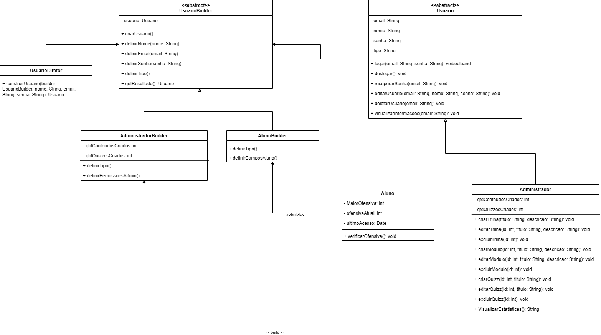

# Builder

## Participantes

Os participantes da elaboração deste documento estão descritos na tabela a seguir:

**Tabela 1: Participantes**

| Matrícula | Aluno             |
| --------- | ----------------- |
| 231027032 | Arthur Oliveira   |
| 231037665 | Daniel Nascimento |
| 231026699 | Eduarda Rodrigues |
| 231038303 | Yan Aguiar        |

---

## 1. Introdução

O **Builder** é um padrão de projeto criacional catalogado pela Gang of Four (GoF) que tem como objetivo separar a **construção** de um objeto complexo de sua **representação final**, de modo que o mesmo processo de construção possa criar diferentes representações (GAMMA et al., 1995).

Em outras palavras, o Builder delega a responsabilidade de montar passo a passo os atributos de um objeto a uma classe especializada, o _Builder_ concreto, enquanto um _Diretor_ define a sequência de montagem. O cliente, por sua vez, apenas solicita ao Diretor que construa o produto, sem precisar conhecer os detalhes internos de cada etapa.

### Quando aplicar?

- Quando o processo de criação de um objeto envolve **muitas etapas ou parâmetros opcionais**;
- Quando o mesmo algoritmo de construção deve produzir **tipos diferentes do mesmo produto**;
- Quando se deseja **isolar o código de construção** do código de representação, reduzindo acoplamento.

---

## 2. Metodologia

No contexto da plataforma **ConhecendoRequisitos**, os usuários são divididos em dois perfis distintos: **Aluno** e **Administrador**. Embora ambos compartilhem atributos comuns (nome, e-mail, senha e tipo), cada perfil possui atributos e comportamentos exclusivos:

- O **Aluno** possui rastreamento de ofensiva de estudos (`MaiorOfensiva`, `ofensivaAtual`, `ultimoAcesso`) e o método `verificarOfensiva()`;
- O **Administrador** possui contadores de conteúdos e quizzes criados (`qtdConteudosCriados`, `qtdQuizzesCriados`) e permissões administrativas completas.

Sem o padrão Builder, o cadastro de usuários exigiria construtores sobrecarregados ou lógica condicional espalhada pelo sistema. Com o Builder, cada variante de usuário possui seu próprio builder concreto, garantindo que apenas os campos relevantes sejam definidos.

---

## 3. Estrutura e Participantes

A estrutura do padrão Builder aplicada ao projeto é composta pelas seguintes classes:

**Tabela 2: Participantes do padrão Builder**

| Papel no Padrão     | Classe no Projeto                     | Responsabilidade                                                                |
| ------------------- | ------------------------------------- | ------------------------------------------------------------------------------- |
| **Builder**         | `UsuarioBuilder`                      | Classe abstrata que define a interface de construção comum a todos os builders. |
| **ConcreteBuilder** | `AlunoBuilder`                        | Implementa os passos de construção específicos para criar um `Aluno`.           |
| **ConcreteBuilder** | `AdministradorBuilder`                | Implementa os passos de construção específicos para criar um `Administrador`.   |
| **Director**        | `UsuarioDiretor`                      | Orquestra a sequência de chamadas ao builder para montar um usuário completo.   |
| **Product**         | `Usuario` / `Aluno` / `Administrador` | Os objetos finais construídos pelo processo.                                    |

### 3.1. Diagrama de Classes (Builder)

O diagrama a seguir representa as classes envolvidas no padrão Builder dentro do projeto:



> **Figura 1:** Diagrama de Classes do padrão Builder aplicado à gestão de usuários da plataforma ConhecendoRequisitos.

## 4. Descrição das Classes

### 4.1. `UsuarioBuilder` (Builder Abstrato)

Classe abstrata que declara todos os métodos de construção comuns. Mantém internamente uma instância de `Usuario` que é populada a cada passo.

| Atributo / Método             | Descrição                                                  |
| ----------------------------- | ---------------------------------------------------------- |
| `usuario: Usuario`            | Instância do produto sendo construído                      |
| `criarUsuario()`              | Reinicia o estado interno, preparando um novo produto      |
| `definirNome(nome: String)`   | Define o nome do usuário                                   |
| `definirEmail(email: String)` | Define o e-mail do usuário                                 |
| `definirSenha(senha: String)` | Define a senha do usuário                                  |
| `definirTipo()`               | Método abstrato: define o tipo conforme o builder concreto |
| `getResultado(): Usuario`     | Retorna o produto finalizado                               |

### 4.2. `AlunoBuilder` (Builder Concreto)

Herda de `UsuarioBuilder` e implementa os passos específicos para construir um `Aluno`.

| Atributo / Método      | Descrição                                                                     |
| ---------------------- | ----------------------------------------------------------------------------- |
| `definirTipo()`        | Define `tipo = "aluno"` e instancia um objeto `Aluno`                         |
| `definirCamposAluno()` | Define os campos exclusivos: `MaiorOfensiva`, `ofensivaAtual`, `ultimoAcesso` |

### 4.3. `AdministradorBuilder` (Builder Concreto)

Herda de `UsuarioBuilder` e implementa os passos específicos para construir um `Administrador`.

| Atributo / Método          | Descrição                                                             |
| -------------------------- | --------------------------------------------------------------------- |
| `qtdConteudosCriados: int` | Contador de conteúdos criados pelo administrador (padrão: 0)          |
| `qtdQuizzesCriados: int`   | Contador de quizzes criados pelo administrador (padrão: 0)            |
| `definirTipo()`            | Define `tipo = "administrador"` e instancia um objeto `Administrador` |
| `definirPermissoesAdmin()` | Inicializa os campos administrativos com valores padrão               |

### 4.4. `UsuarioDiretor` (Diretor)

Conhece a sequência correta de chamadas ao Builder para montar um usuário completo. O cliente interage apenas com o Diretor, não com o Builder diretamente.

| Método                                                   | Descrição                                              |
| -------------------------------------------------------- | ------------------------------------------------------ |
| `construirUsuario(builder, nome, email, senha): Usuario` | Executa todos os passos de construção na ordem correta |

---

## 5. Implementação

O código a seguir implementa o padrão Builder em **JavaScript (Node.js)**, seguindo fielmente o diagrama de classes do projeto. O JavaScript foi escolhido por ser a linguagem com maior familiaridade da equipe, conforme observado na aba [Conhecimentos da Equipe](https://unbarqdsw2026-1-turma01.github.io/Grupo02_ConhecendoRequisitos_Entrega01/#/Base/1.5.4.Conhecimentos) feito na [Entrega 1](https://unbarqdsw2026-1-turma01.github.io/Grupo02_ConhecendoRequisitos_Entrega01/#/Base) e também por permitir execução direta via Node.js sem configuração adicional.

<details>
<summary><b>Ver Código Fonte</b></summary>

```javascript
// ─────────────────────────────────────────
// PRODUTOS (Product)
// ─────────────────────────────────────────

/**
 * Classe base abstrata que representa qualquer usuário da plataforma.
 * Não deve ser instanciada diretamente.
 */
class Usuario {
  constructor() {
    if (new.target === Usuario) {
      throw new Error(
        "Usuario é uma classe abstrata e não pode ser instanciada diretamente.",
      );
    }
    this.email = "";
    this.nome = "";
    this.senha = "";
    this.tipo = "";
  }

  logar(email, senha) {
    return this.email === email && this.senha === senha;
  }
  deslogar() {
    console.log(
      `[${this.tipo.toUpperCase()}] ${this.nome} deslogado com sucesso.`,
    );
  }

  recuperarSenha(email) {
    if (this.email === email) {
      console.log(`Link de recuperação enviado para: ${email}`);
    } else {
      console.log("E-mail não encontrado.");
    }
  }

  editarUsuario(email, nome, senha) {
    this.email = email;
    this.nome = nome;
    this.senha = senha;
  }

  deletarUsuario(email) {
    if (this.email === email) {
      console.log(`Conta de '${this.nome}' excluída.`);
    } else {
      console.log("Confirmação de e-mail falhou.");
    }
  }

  visualizarInformacoes(email) {
    if (this.email === email) {
      console.log(
        `Nome: ${this.nome} | E-mail: ${this.email} | Tipo: ${this.tipo}`,
      );
    }
  }

  toString() {
    return `${this.constructor.name}(nome='${this.nome}', email='${this.email}', tipo='${this.tipo}')`;
  }
}

/**
 * Representa um aluno com rastreamento de ofensiva de estudos.
 */
class Aluno extends Usuario {
  constructor() {
    super();
    this.tipo = "aluno";
    this.MaiorOfensiva = 0;
    this.ofensivaAtual = 0;
    this.ultimoAcesso = new Date().toISOString().slice(0, 10); // "YYYY-MM-DD"
  }

  /**
   * Verifica se o aluno acessou hoje e atualiza a ofensiva.
   * - Mesmo dia  → mantém a ofensiva
   * - 1 dia depois → incrementa
   * - Mais de 1 dia → reinicia
   */
  verificarOfensiva() {
    const hoje = new Date().toISOString().slice(0, 10);
    const ultimo = this.ultimoAcesso;

    if (ultimo === hoje) {
      console.log(
        `Ofensiva mantida! Sequência atual: ${this.ofensivaAtual} dias.`,
      );
      return;
    }

    const diffMs = new Date(hoje) - new Date(ultimo);
    const diffDias = Math.round(diffMs / (1000 * 60 * 60 * 24));

    if (diffDias === 1) {
      this.ofensivaAtual += 1;
      if (this.ofensivaAtual > this.MaiorOfensiva) {
        this.MaiorOfensiva = this.ofensivaAtual;
      }
      console.log(`Ofensiva aumentada para ${this.ofensivaAtual} dias!`);
    } else {
      this.ofensivaAtual = 1;
      console.log("Ofensiva reiniciada. Não perca o fio!");
    }

    this.ultimoAcesso = hoje;
  }
}

/**
 * Representa um administrador com poderes de gestão de conteúdo e quizzes.
 */
class Administrador extends Usuario {
  constructor() {
    super();
    this.tipo = "administrador";
    this.qtdConteudosCriados = 0;
    this.qtdQuizzesCriados = 0;
  }

  criarTrilha(titulo, descricao) {
    console.log(`Trilha '${titulo}' criada: ${descricao}`);
  }

  editarTrilha(id, titulo, descricao) {
    console.log(`Trilha ${id} editada para '${titulo}'.`);
  }

  excluirTrilha(id) {
    console.log(`Trilha ${id} excluída.`);
  }

  criarModulo(id, titulo, descricao) {
    this.qtdConteudosCriados += 1;
    console.log(
      `Módulo '${titulo}' criado (total: ${this.qtdConteudosCriados}).`,
    );
  }

  editarModulo(id, titulo, descricao) {
    console.log(`Módulo ${id} editado.`);
  }

  excluirModulo(id) {
    console.log(`Módulo ${id} excluído.`);
  }

  criarQuizz(id, titulo) {
    this.qtdQuizzesCriados += 1;
    console.log(`Quiz '${titulo}' criado (total: ${this.qtdQuizzesCriados}).`);
  }

  editarQuizz(id, titulo) {
    console.log(`Quiz ${id} editado para '${titulo}'.`);
  }

  excluirQuizz(id) {
    console.log(`Quiz ${id} excluído.`);
  }

  VisualizarEstatisticas() {
    return (
      `Estatísticas do Admin '${this.nome}':\n` +
      `  Conteúdos criados : ${this.qtdConteudosCriados}\n` +
      `  Quizzes criados   : ${this.qtdQuizzesCriados}`
    );
  }
}

// ─────────────────────────────────────────
// BUILDER (Interface abstrata)
// ─────────────────────────────────────────

/**
 * Classe abstrata do Builder.
 * Define a interface de construção comum a todos os builders concretos.
 */
class UsuarioBuilder {
  constructor() {
    if (new.target === UsuarioBuilder) {
      throw new Error("UsuarioBuilder é abstrato.");
    }
    this.usuario = null;
  }

  /** @abstract — deve ser implementado pelos builders concretos */
  definirTipo() {
    throw new Error(
      "definirTipo() deve ser implementado pelo builder concreto.",
    );
  }

  definirNome(nome) {
    this.usuario.nome = nome;
  }

  definirEmail(email) {
    this.usuario.email = email;
  }

  definirSenha(senha) {
    this.usuario.senha = senha;
  }

  /** Retorna o produto e limpa o estado interno do builder. */
  getResultado() {
    const resultado = this.usuario;
    this.usuario = null;
    return resultado;
  }
}

// ─────────────────────────────────────────
// BUILDERS CONCRETOS (Concrete Builders)
// ─────────────────────────────────────────

/**
 * Builder concreto para construção de objetos Aluno.
 */
class AlunoBuilder extends UsuarioBuilder {
  /** Instancia o produto Aluno. */
  definirTipo() {
    this.usuario = new Aluno();
  }

  definirCamposAluno() {
    if (!(this.usuario instanceof Aluno)) {
      throw new Error(
        "definirTipo() deve ser chamado antes de definirCamposAluno().",
      );
    }
    this.usuario.MaiorOfensiva = 0;
    this.usuario.ofensivaAtual = 0;
    this.usuario.ultimoAcesso = new Date().toISOString().slice(0, 10);
  }
}

/**
 * Builder concreto para construção de objetos Administrador.
 */
class AdministradorBuilder extends UsuarioBuilder {
  constructor() {
    super();
    this.qtdConteudosCriados = 0;
    this.qtdQuizzesCriados = 0;
  }

  /** Instancia o produto Administrador. */
  definirTipo() {
    this.usuario = new Administrador();
  }

  definirPermissoesAdmin() {
    if (!(this.usuario instanceof Administrador)) {
      throw new Error(
        "definirTipo() deve ser chamado antes de definirPermissoesAdmin().",
      );
    }
    this.usuario.qtdConteudosCriados = this.qtdConteudosCriados;
    this.usuario.qtdQuizzesCriados = this.qtdQuizzesCriados;
  }
}

// ─────────────────────────────────────────
// DIRETOR (Director)
// ─────────────────────────────────────────

/**
 * Orquestra a sequência de passos do Builder.
 * O cliente interage apenas com o Diretor.
 */
class UsuarioDiretor {
  /**
   * Constrói um usuário completo usando o builder fornecido.
   * @param {UsuarioBuilder} builder - Builder concreto a ser usado
   * @param {string} nome
   * @param {string} email
   * @param {string} senha
   * @returns {Usuario} - Produto finalizado
   */
  construirUsuario(builder, nome, email, senha) {
    // Passo 1: instancia o produto correto
    builder.definirTipo();

    // Passo 2: campos comuns
    builder.definirNome(nome);
    builder.definirEmail(email);
    builder.definirSenha(senha);

    // Passo 3: campos específicos do tipo
    if (builder instanceof AlunoBuilder) {
      builder.definirCamposAluno();
    } else if (builder instanceof AdministradorBuilder) {
      builder.definirPermissoesAdmin();
    }

    // Passo 4: retorna o produto finalizado
    return builder.getResultado();
  }
}

// ─────────────────────────────────────────
// DEMONSTRAÇÃO DE USO (main)
// ─────────────────────────────────────────

const diretor = new UsuarioDiretor();

// --- Construindo um Aluno ---
const alunoBuilder = new AlunoBuilder();
const aluno = diretor.construirUsuario(
  alunoBuilder,
  "Yasmin Nascimento",
  "yasmin@unb.br",
  "senha123",
);

console.log("=== Aluno criado ===");
console.log(aluno.toString());
aluno.visualizarInformacoes("yasmin@unb.br");
aluno.verificarOfensiva();

console.log();

// --- Construindo um Administrador ---
const adminBuilder = new AdministradorBuilder();
const admin = diretor.construirUsuario(
  adminBuilder,
  "Carlos Nascimento",
  "carlos@unb.br",
  "admin456",
);

console.log("=== Administrador criado ===");
console.log(admin.toString());
admin.visualizarInformacoes("carlos@unb.br");
admin.criarTrilha(
  "Engenharia de Requisitos",
  "Trilha sobre técnicas de elicitação.",
);
admin.criarQuizz(1, "Quiz: Introdução a Requisitos");
console.log(admin.VisualizarEstatisticas());
```

</details>

### 5.1. Saída Esperada

```
=== Aluno criado ===
Aluno(nome='Yasmin Nascimento', email='yasmin@unb.br', tipo='aluno')
Nome: Yasmin Nascimento | E-mail: yasmin@unb.br | Tipo: aluno
Ofensiva mantida! Sequência atual: 0 dias.

=== Administrador criado ===
Administrador(nome='Carlos Nascimento', email='carlos@unb.br', tipo='administrador')
Nome: Carlos Nascimento | E-mail: carlos@unb.br | Tipo: administrador
Trilha 'Engenharia de Requisitos' criada: Trilha sobre técnicas de elicitação.
Quiz 'Quiz: Introdução a Requisitos' criado (total: 1).
Estatísticas do Admin 'Carlos Nascimento':
  Conteúdos criados : 0
  Quizzes criados   : 1
```

## 6. Vídeo de demonstração

<iframe width="560" height="315" src="https://www.youtube.com/embed/ejMkC6va3QE?si=XnvXYRpvqwZuGWXq" title="YouTube video player" frameborder="0" allow="accelerometer; autoplay; clipboard-write; encrypted-media; gyroscope; picture-in-picture; web-share" referrerpolicy="strict-origin-when-cross-origin" allowfullscreen></iframe>

## 7. Repositório com o código

[Clique aqui para visualizar o repositório com o código do builder](https://github.com/UnBArqDsw2026-1-Turma01/2026.1-T01-G02_ConhecendoRequisitos_Entrega_03/tree/main/gofs/criacional/builder)

## 8. Senso Crítico

A aplicação do padrão GOF Builder no contexto do projeto "ConhecendoRequisitos" demonstrou ser uma decisão arquitetural extremamente acertada, especialmente ao gerenciar a criação de diferentes perfis de usuário na plataforma. Em sistemas educacionais, onde diferentes tipos de usuários (como Alunos e Administradores) possuem conjuntos de dados, permissões e comportamentos completamente distintos, a padronização do processo de instanciação é fundamental para manter a consistência e a facilidade de manutenção do código.

O Builder implementado resolve problemas críticos de forma elegante: (1) evita a criação de construtores "telescópicos" gigantescos, que muitas vezes ficariam cheios de parâmetros nulos dependendo do tipo de usuário; (2) centraliza a lógica de instanciação de métricas específicas, como ofensiva de estudos para alunos ou contadores de conteúdo para administradores; e (3) permite adicionar novos tipos de usuários no futuro (como um perfil "Moderador") sem alterar o código já existente. Esta implementação oferece flexibilidade na evolução do sistema sem comprometer a estabilidade do cadastro atual.

A arquitetura escolhida está em total conformidade com os princípios SOLID. O _Single Responsibility Principle_ (SRP) é respeitado ao separar a lógica de construção complexa (alocada nos Builders) da representação final (as classes Aluno e Administrador). O _Open/Closed Principle_ (OCP) permite adicionar novos perfis criando apenas um novo `ConcreteBuilder`, sem precisar modificar o `Diretor` ou a classe base de usuário. Esta separação também facilita futuros testes unitários, permitindo validar a montagem de cada perfil isoladamente.

### Comentários sobre o Trabalho em Equipe

O desenvolvimento do padrão Builder foi realizado de forma colaborativa entre os membros, com revisões e discussões arquiteturais constantes. A equipe iniciou com uma análise conjunta dos requisitos de perfis (US01 e US02) presente no [Product Backlog](https://unbarqdsw2026-1-turma01.github.io/2026.1-T01-_G2_ConhecendoRequisitos_Entrega_02/#/Modelagem/2.5.3.Backlog) realizado na [Entrega 2](https://unbarqdsw2026-1-turma01.github.io/2026.1-T01-_G2_ConhecendoRequisitos_Entrega_02/#/), identificando quais campos seriam comuns a todos e quais seriam exclusivos de cada papel.

---

## 9. Conclusão

A aplicação do padrão **Builder** na plataforma "ConhecendoRequisitos" provou ser uma decisão arquitetural sólida para o gerenciamento da criação de perfis de usuário (`Aluno` e `Administrador`). O padrão resolveu a complexidade inerente de instanciar objetos com atributos distintos, evitando construtores "gordos" (telescópicos) e lógica condicional excessiva. Com isso, a base de código manteve-se alinhada aos princípios SOLID (notadamente Responsabilidade Única e Aberto/Fechado), favorecendo futuras expansões do sistema, como a potencial adição de novos perfis no backlog.

---

## Referências Bibliográficas

1. GAMMA, E.; HELM, R.; JOHNSON, R.; VLISSIDES, J. **Design Patterns: Elements of Reusable Object-Oriented Software**. Reading, MA: Addison-Wesley, 1995.

2. REFACTORING GURU. **Builder**. Disponível em: [https://refactoring.guru/design-patterns/builder](https://refactoring.guru/design-patterns/builder). Acesso em: 09 mai. 2026.

3. FREEMAN, E.; ROBSON, E. **Head First Design Patterns**. 2. ed. Sebastopol, CA: O'Reilly Media, 2020.

4. SCHWABER, K.; SUTHERLAND, J. **O Guia do Scrum**. Scrum.org, 2020. Disponível em: [https://scrumguides.org/docs/scrumguide/v2020/2020-Scrum-Guide-PortugueseBR.pdf](https://scrumguides.org/docs/scrumguide/v2020/2020-Scrum-Guide-PortugueseBR.pdf). Acesso em: 09 mai. 2026.

---

## Histórico de Versões

| Versão | Data  | Descrição                                                   | Autor(es)                                         | Revisor(es)                                       | Detalhes da Revisão |
| ------ | ----- | ----------------------------------------------------------- | ------------------------------------------------- | ------------------------------------------------- | ------------------- |
| 1.0    | 09/05 | Criação do documento e criação do diagrama de Classes (UML) | [Yan Aguiar](https://github.com/Yanmatheus0812)   | [Arthur Oliveira](https://github.com/arthurevang) | Documento criado    |
| 1.1    | 09/05 | Implementação e revisão do padrão Builder                   | [Arthur Oliveira](https://github.com/arthurevang) | [Yan Aguiar](https://github.com/Yanmatheus0812)   | Revisado e aprovado |
| 1.2    | 13/05 | Gravação e link do repositório                              | [Yan Aguiar](https://github.com/Yanmatheus0812)   | [Arthur Oliveira](https://github.com/arthurevang) | Revisado e aprovado |
