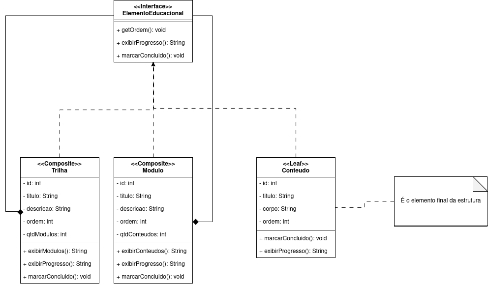

# Composite

## Participantes

Os participantes da elaboração deste documento estão descritos na tabela a seguir:

| Matrícula | Aluno         |
| --------- | ------------- |
| 222006650 | Davi Sousa    |
| 231035455 | Leticia Jesus |
| 231038303 | Yan Aguiar    |

## 1. Introdução

O **Composite** é um padrão de projeto estrutural da Gang of Four (GoF) que permite tratar **objetos individuais** e **composições de objetos** de maneira uniforme. A ideia central é organizar elementos em uma estrutura hierárquica em árvore, na qual um componente composto pode conter outros componentes, inclusive outros compostos, enquanto o elemento folha representa a unidade final da estrutura.

Esse padrão é útil quando a aplicação precisa trabalhar com partes e conjuntos usando a mesma interface, simplificando a navegação, a exibição e o processamento recursivo da hierarquia.

## 2. Metodologia

No contexto da plataforma **ConhecendoRequisitos**, o padrão Composite foi aplicado para representar a organização dos elementos educacionais em uma estrutura hierárquica. A proposta do modelo é permitir que uma **Trilha** contenha vários **Módulos**, e que cada **Módulo** contenha vários **Conteúdos**.

Com isso, a plataforma consegue tratar toda a estrutura de forma uniforme por meio de uma interface comum, facilitando operações como exibir progresso, marcar itens como concluídos e percorrer os elementos da hierarquia sem precisar diferenciar manualmente cada nível da árvore.

## 3. Estrutura e Participantes

A estrutura do padrão Composite aplicada ao projeto é composta pelos seguintes elementos:

**Tabela 1: Participantes do padrão Composite**

| Papel no Padrão | Classe no Projeto   | Responsabilidade                                                |
| --------------- | ------------------- | --------------------------------------------------------------- |
| **Component**   | ElementoEducacional | Define a interface comum para todos os elementos da hierarquia. |
| **Composite**   | Trilha              | Representa o elemento mais alto da estrutura e agrupa módulos.  |
| **Composite**   | Modulo              | Agrupa conteúdos e mantém a composição da trilha.               |
| **Leaf**        | Conteudo            | Representa o elemento final da estrutura, sem filhos.           |

### 3.1. Diagrama de Classes (Composite)

O diagrama a seguir representa as classes envolvidas no padrão Composite dentro do projeto:

> **Figura 1:** Diagrama de Classes do padrão Composite aplicado à organização dos elementos educacionais da plataforma ConhecendoRequisitos.

## 4. Descrição das Classes

### 4.1. ElementoEducacional (Component)

Interface comum que define as operações compartilhadas por todos os elementos da estrutura.

| Atributo / Método | Descrição                                           |
| ----------------- | --------------------------------------------------- |
| getOrdem()        | Retorna a posição do elemento dentro da hierarquia. |
| exibirProgresso() | Exibe o progresso associado ao elemento.            |
| marcarConcluido() | Marca o elemento como concluído.                    |

### 4.2. Trilha (Composite)

Classe que representa o topo da hierarquia e pode conter módulos.

| Atributo / Método | Descrição                                |
| ----------------- | ---------------------------------------- |
| id: int           | Identificador da trilha.                 |
| titulo: String    | Nome da trilha.                          |
| descricao: String | Descrição da trilha.                     |
| ordem: int        | Posição da trilha dentro da estrutura.   |
| qtdModulos: int   | Quantidade de módulos vinculados.        |
| exibirModulos()   | Exibe os módulos contidos na trilha.     |
| exibirProgresso() | Exibe o progresso consolidado da trilha. |
| marcarConcluido() | Marca a trilha como concluída.           |

### 4.3. Modulo (Composite)

Classe intermediária da hierarquia, responsável por agrupar conteúdos.

| Atributo / Método | Descrição                                |
| ----------------- | ---------------------------------------- |
| id: int           | Identificador do módulo.                 |
| titulo: String    | Nome do módulo.                          |
| descricao: String | Descrição do módulo.                     |
| ordem: int        | Posição do módulo dentro da trilha.      |
| qtdConteudos: int | Quantidade de conteúdos vinculados.      |
| exibirConteudos() | Exibe os conteúdos contidos no módulo.   |
| exibirProgresso() | Exibe o progresso consolidado do módulo. |
| marcarConcluido() | Marca o módulo como concluído.           |

### 4.4. Conteudo (Leaf)

Elemento final da estrutura, sem filhos, responsável pelo conteúdo educacional em si.

| Atributo / Método | Descrição                                |
| ----------------- | ---------------------------------------- |
| id: int           | Identificador do conteúdo.               |
| titulo: String    | Nome do conteúdo.                        |
| corpo: String     | Texto ou material principal do conteúdo. |
| ordem: int        | Posição do conteúdo dentro do módulo.    |
| marcarConcluido() | Marca o conteúdo como concluído.         |
| exibirProgresso() | Exibe o progresso do conteúdo.           |

## 5. Implementação

### Saída esperada

## 6. Vídeo de demonstração

## 7. Repositório com o código

## 8. Senso crítico

## 9. Conclusão

## Referências bibliográficas

## Histórico de versões

| Versão | Data  | Descrição                     | Autor(es)                                       | Revisor(es)                                       | Detalhes da Revisão |
| ------ | ----- | ----------------------------- | ----------------------------------------------- | ------------------------------------------------- | ------------------- |
| 1.0    | 15/05 | Criação do documento e codigo | [Yan Aguiar](https://github.com/Yanmatheus0812) | [Arthur Oliveira](https://github.com/arthurevang) | Documento criado    |
