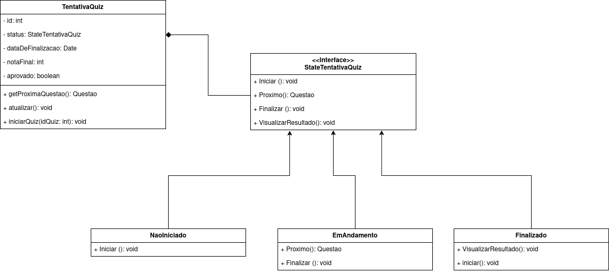

# State

## Participantes

Os participantes da elaboração deste documento estão descritos na tabela a seguir:

| Matrícula | Aluno              |
| --------- | ------------------ |
| 231026699 | Eduarda Rodrigues  |
| 231037692 | Isabella Choukaira |
| 231038303 | Yan Aguiar         |

## 1. Introdução

O **State** é um padrão de projeto comportamental da Gang of Four (GoF) que permite que um objeto altere o próprio comportamento quando seu estado interno muda. Em vez de concentrar todas as regras em um único bloco condicional, o padrão separa cada estado em uma classe específica, deixando o contexto delegar o comportamento ao estado atual.

Esse padrão é útil quando um objeto precisa se comportar de maneiras diferentes ao longo do tempo e essas mudanças dependem de transições bem definidas. Assim, o código fica mais organizado, extensível e fácil de manter, principalmente quando o fluxo possui várias fases.

## 2. Metodologia

No contexto da plataforma **ConhecendoRequisitos**, o padrão State foi aplicado para representar o ciclo de vida de uma **TentativaQuiz**. A ideia é que a tentativa comece no estado **Não Iniciado**, avance para **Em Andamento** quando o aluno começar a responder e, ao final, passe para **Finalizado**.

Com isso, o contexto `TentativaQuiz` não precisa concentrar toda a lógica de validação e transição em condicionais grandes. Cada estado sabe exatamente o que pode ou não fazer em determinado momento, o que deixa o fluxo mais claro e coerente com o funcionamento real de uma tentativa de quiz.

## 3. Diagrama

O diagrama a seguir representa as classes envolvidas no padrão State dentro do projeto:



> **Figura 1:** Diagrama de Classes do padrão State aplicado ao ciclo de vida da tentativa de quiz na plataforma ConhecendoRequisitos.

## 4. Descrição das Classes

### 4.1. StateTentativaQuiz (Interface State)

Interface base que define o contrato dos estados possíveis da tentativa de quiz.

| Método                | Descrição                                                        |
| --------------------- | ---------------------------------------------------------------- |
| iniciar()             | Inicia a tentativa a partir do estado atual.                     |
| proximo()             | Avança para a próxima questão, quando permitido.                 |
| finalizar()           | Finaliza a tentativa e consolida o resultado.                    |
| visualizarResultado() | Exibe o resultado final quando a tentativa já estiver concluída. |

### 4.2. TentativaQuiz (Context)

Classe que representa a tentativa do aluno e delega o comportamento ao estado atual.

| Atributo / Método        | Descrição                                           |
| ------------------------ | --------------------------------------------------- |
| id: int                  | Identificador da tentativa.                         |
| quiz: Quiz               | Quiz associado à tentativa.                         |
| status: string           | Estado textual da tentativa.                        |
| dataDeFinalizacao: Date  | Data de encerramento da tentativa.                  |
| notaFinal: int           | Nota consolidada ao final.                          |
| aprovado: boolean        | Indica se a tentativa foi aprovada.                 |
| getProximaQuestao()      | Solicita ao estado atual a próxima questão.         |
| iniciarQuiz(idQuiz: int) | Inicia a tentativa para o quiz informado.           |
| atualizar()              | Exibe o resumo do estado atual.                     |
| finalizar()              | Delega a finalização ao estado atual.               |
| visualizarResultado()    | Delega a visualização do resultado ao estado atual. |

### 4.3. NaoIniciado (ConcreteState)

Estado inicial da tentativa, antes do aluno começar a responder o quiz.

| Método                | Descrição                                             |
| --------------------- | ----------------------------------------------------- |
| iniciar()             | Transiciona a tentativa para `EmAndamento`.           |
| proximo()             | Informa que não é possível avançar antes do início.   |
| finalizar()           | Informa que não é possível finalizar antes do início. |
| visualizarResultado() | Informa que o resultado ainda não está disponível.    |

### 4.4. EmAndamento (ConcreteState)

Estado ativo da tentativa, quando o aluno está respondendo às questões.

| Método                | Descrição                                                            |
| --------------------- | -------------------------------------------------------------------- |
| iniciar()             | Informa que a tentativa já está em andamento.                        |
| proximo()             | Retorna a próxima questão disponível.                                |
| finalizar()           | Calcula a nota, encerra a tentativa e transiciona para `Finalizado`. |
| visualizarResultado() | Informa que o resultado só pode ser visto após finalizar.            |

### 4.5. Finalizado (ConcreteState)

Estado final da tentativa, quando o quiz já foi encerrado.

| Método                | Descrição                                        |
| --------------------- | ------------------------------------------------ |
| iniciar()             | Informa que a tentativa não pode ser reiniciada. |
| proximo()             | Informa que não existem próximas questões.       |
| finalizar()           | Informa que a tentativa já está finalizada.      |
| visualizarResultado() | Exibe a nota final e o status de aprovação.      |

## 5. Implementação

A implementação foi feita em **JavaScript (Node.js)** e organizada na pasta [gofs/comportamentais/state](../../gofs/comportamentais/state/index.js), seguindo a mesma ideia de demonstração usada no Composite: arquivos separados para o contexto, os estados concretos e um arquivo de entrada para executar o fluxo completo.

<details>
<summary><b>Ver Código Fonte</b></summary>

**StateTentativaQuiz.js** — Interface base dos estados:

```javascript
class StateTentativaQuiz {
  constructor(tentativaQuiz) {
    if (new.target === StateTentativaQuiz) {
      throw new Error(
        "StateTentativaQuiz é abstrato e não pode ser instanciado diretamente.",
      );
    }

    this.tentativaQuiz = tentativaQuiz;
  }

  iniciar() {
    throw new Error("iniciar() deve ser implementado pela classe concreta.");
  }

  proximo() {
    throw new Error("proximo() deve ser implementado pela classe concreta.");
  }

  finalizar() {
    throw new Error("finalizar() deve ser implementado pela classe concreta.");
  }

  visualizarResultado() {
    throw new Error(
      "visualizarResultado() deve ser implementado pela classe concreta.",
    );
  }
}

module.exports = StateTentativaQuiz;
```

**NaoIniciado.js** — Estado inicial da tentativa:

```javascript
const StateTentativaQuiz = require("./StateTentativaQuiz");

class NaoIniciado extends StateTentativaQuiz {
  iniciar() {
    const EmAndamento = require("./EmAndamento");

    this.tentativaQuiz.status = "Em andamento";
    console.log(
      `[NAO_INICIADO] Tentativa ${this.tentativaQuiz.id} iniciada para o quiz ${this.tentativaQuiz.quiz.id}.`,
    );
    this.tentativaQuiz.setState(new EmAndamento(this.tentativaQuiz));
    this.tentativaQuiz.atualizar();
  }

  proximo() {
    console.log(
      `[NAO_INICIADO] Não é possível avançar porque a tentativa ainda não foi iniciada.`,
    );
    return null;
  }

  finalizar() {
    console.log(
      `[NAO_INICIADO] Não é possível finalizar uma tentativa que ainda não começou.`,
    );
    return null;
  }

  visualizarResultado() {
    console.log(
      `[NAO_INICIADO] Resultado indisponível enquanto a tentativa não for iniciada.`,
    );
    return null;
  }
}

module.exports = NaoIniciado;
```

**EmAndamento.js** — Estado ativo da tentativa:

```javascript
const StateTentativaQuiz = require("./StateTentativaQuiz");

class EmAndamento extends StateTentativaQuiz {
  iniciar() {
    console.log(
      `[EM_ANDAMENTO] A tentativa ${this.tentativaQuiz.id} já está em andamento.`,
    );
  }

  proximo() {
    const questao = this.tentativaQuiz.obterQuestaoDisponivel();

    if (!questao) {
      console.log("[EM_ANDAMENTO] Não há mais questões disponíveis.");
      return null;
    }

    this.tentativaQuiz.marcarQuestaoAtual(questao);
    console.log(`[EM_ANDAMENTO] Próxima questão: ${questao.enunciado}.`);
    return questao;
  }

  finalizar() {
    const Finalizado = require("./Finalizado");

    this.tentativaQuiz.calcularNotaFinal();
    this.tentativaQuiz.status = "Finalizado";
    this.tentativaQuiz.dataDeFinalizacao = new Date();
    console.log(
      `[EM_ANDAMENTO] Tentativa ${this.tentativaQuiz.id} finalizada.`,
    );
    this.tentativaQuiz.setState(new Finalizado(this.tentativaQuiz));
    this.tentativaQuiz.atualizar();
    return this.tentativaQuiz;
  }

  visualizarResultado() {
    console.log(
      `[EM_ANDAMENTO] O resultado só pode ser visualizado após a finalização.`,
    );
    return null;
  }
}

module.exports = EmAndamento;
```

**Finalizado.js** — Estado final da tentativa:

```javascript
const StateTentativaQuiz = require("./StateTentativaQuiz");

class Finalizado extends StateTentativaQuiz {
  iniciar() {
    console.log(
      `[FINALIZADO] A tentativa ${this.tentativaQuiz.id} já foi finalizada e não pode ser reiniciada.`,
    );
  }

  proximo() {
    console.log(
      `[FINALIZADO] Não existem próximas questões porque a tentativa já terminou.`,
    );
    return null;
  }

  finalizar() {
    console.log(
      `[FINALIZADO] A tentativa ${this.tentativaQuiz.id} já está finalizada.`,
    );
    return this.tentativaQuiz;
  }

  visualizarResultado() {
    const mensagem = `[FINALIZADO] Resultado da tentativa ${this.tentativaQuiz.id}: nota ${this.tentativaQuiz.notaFinal}%, ${this.tentativaQuiz.aprovado ? "aprovado" : "reprovado"}.`;
    console.log(mensagem);
    return mensagem;
  }
}

module.exports = Finalizado;
```

**TentativaQuiz.js** — Contexto que delega ao estado atual:

```javascript
const NaoIniciado = require("./NaoIniciado");

class TentativaQuiz {
  constructor(id, quiz) {
    this.id = id;
    this.quiz = quiz;
    this.status = "Não iniciado";
    this.dataDeFinalizacao = null;
    this.notaFinal = 0;
    this.aprovado = false;
    this.questaoAtual = null;
    this.respostas = [];
    this.acertos = 0;
    this.indiceAtual = 0;
    this.state = new NaoIniciado(this);
  }

  setState(state) {
    this.state = state;
  }

  iniciarQuiz(idQuiz) {
    console.log(`[TENTATIVA_QUIZ] Solicitado início do quiz ${idQuiz}.`);

    if (!this.quiz || this.quiz.id !== idQuiz) {
      console.log(
        `[TENTATIVA_QUIZ] O quiz informado não corresponde a esta tentativa.`,
      );
      return;
    }

    this.state.iniciar();
  }

  getProximaQuestao() {
    return this.state.proximo();
  }

  registrarResposta(correta) {
    if (!this.questaoAtual) {
      console.log(
        `[TENTATIVA_QUIZ] Nenhuma questão ativa para registrar resposta.`,
      );
      return;
    }

    this.respostas.push({
      questaoId: this.questaoAtual.id,
      correta,
    });

    if (correta) {
      this.acertos += 1;
    }

    console.log(
      `[TENTATIVA_QUIZ] Resposta da questão ${this.questaoAtual.id}: ${correta ? "correta" : "incorreta"}.`,
    );
    this.questaoAtual = null;
  }

  marcarQuestaoAtual(questao) {
    this.questaoAtual = questao;
    this.indiceAtual += 1;
  }

  obterQuestaoDisponivel() {
    return this.quiz.questoes[this.indiceAtual] ?? null;
  }

  calcularNotaFinal() {
    const totalQuestoes = this.quiz.questoes.length;
    this.notaFinal =
      totalQuestoes === 0
        ? 0
        : Math.round((this.acertos / totalQuestoes) * 100);
    this.aprovado = this.notaFinal >= 70;
  }

  atualizar() {
    console.log(
      `[TENTATIVA_QUIZ] Status=${this.status}, respostas=${this.respostas.length}/${this.quiz.questoes.length}, nota=${this.notaFinal}%.`,
    );
  }

  finalizar() {
    return this.state.finalizar();
  }

  visualizarResultado() {
    return this.state.visualizarResultado();
  }

  toString() {
    return `TentativaQuiz(id=${this.id}, status='${this.status}', notaFinal=${this.notaFinal}, aprovado=${this.aprovado})`;
  }
}

module.exports = TentativaQuiz;
```

**index.js** — Demonstração completa do fluxo:

```javascript
const Quiz = require("./Quiz");
const Questao = require("./Questao");
const TentativaQuiz = require("./TentativaQuiz");

console.log("======================================");
console.log("  DEMONSTRAÇÃO — Padrão State");
console.log("======================================\n");

const quiz = new Quiz(1, "Quiz: Introdução a Requisitos");
quiz.adicionarQuestao(
  new Questao(1, "O que é um requisito?", "Uma necessidade do sistema"),
);
quiz.adicionarQuestao(
  new Questao(2, "Qual a função do estado?", "Controlar o comportamento"),
);
quiz.adicionarQuestao(
  new Questao(3, "O que o Finalizado permite?", "Visualizar o resultado"),
);

const tentativa = new TentativaQuiz(1, quiz);

console.log("--- Estrutura criada ---");
console.log(quiz.toString());
console.log(quiz.exibirQuestoes());
console.log(tentativa.toString());

console.log("\n--- Estado inicial ---");
tentativa.atualizar();

console.log("\n--- Iniciando tentativa ---");
tentativa.iniciarQuiz(quiz.id);

console.log("\n--- Respondendo questões ---");
let questaoAtual = tentativa.getProximaQuestao();
while (questaoAtual) {
  console.log(`[ALUNO] Respondendo: ${questaoAtual.enunciado}`);
  tentativa.registrarResposta(true);
  questaoAtual = tentativa.getProximaQuestao();
}

console.log("\n--- Finalizando tentativa ---");
tentativa.finalizar();

console.log("\n--- Resultado final ---");
tentativa.visualizarResultado();
console.log(tentativa.toString());

console.log("\n======================================");
console.log("  FIM DA DEMONSTRAÇÃO");
console.log("======================================");
```

</details>

### Saída esperada

```
======================================
	DEMONSTRAÇÃO — Padrão State
======================================

--- Estrutura criada ---
Quiz(id=1, titulo='Quiz: Introdução a Requisitos', qtdQuestoes=3)
Quiz 'Quiz: Introdução a Requisitos'
- 1. O que é um requisito?
- 2. Qual a função do estado?
- 3. O que o Finalizado permite?
TentativaQuiz(id=1, status='Não iniciado', notaFinal=0, aprovado=false)

--- Estado inicial ---
[TENTATIVA_QUIZ] Status=Não iniciado, respostas=0/3, nota=0%.

--- Iniciando tentativa ---
[TENTATIVA_QUIZ] Solicitado início do quiz 1.
[NAO_INICIADO] Tentativa 1 iniciada para o quiz 1.
[TENTATIVA_QUIZ] Status=Em andamento, respostas=0/3, nota=0%.

--- Respondendo questões ---
[EM_ANDAMENTO] Próxima questão: O que é um requisito?.
[ALUNO] Respondendo: O que é um requisito?
[TENTATIVA_QUIZ] Resposta da questão 1: correta.
[EM_ANDAMENTO] Próxima questão: Qual a função do estado?.
[ALUNO] Respondendo: Qual a função do estado?
[TENTATIVA_QUIZ] Resposta da questão 2: correta.
[EM_ANDAMENTO] Próxima questão: O que o Finalizado permite?.
[ALUNO] Respondendo: O que o Finalizado permite?
[TENTATIVA_QUIZ] Resposta da questão 3: correta.
[EM_ANDAMENTO] Não há mais questões disponíveis.

--- Finalizando tentativa ---
[EM_ANDAMENTO] Tentativa 1 finalizada.
[TENTATIVA_QUIZ] Status=Finalizado, respostas=3/3, nota=100%.

--- Resultado final ---
[FINALIZADO] Resultado da tentativa 1: nota 100%, aprovado.
TentativaQuiz(id=1, status='Finalizado', notaFinal=100, aprovado=true)

======================================
	FIM DA DEMONSTRAÇÃO
======================================
```

## Vídeo de demonstração

## Repositório com o código

[Clique aqui para visualizar o código do State](https://github.com/UnBArqDsw2026-1-Turma01/2026.1-T01-G02_ConhecendoRequisitos_Entrega_03/tree/main/gofs/comportamentais/state)

## 6. Senso Crítico

A aplicação do padrão **State** no contexto do projeto **ConhecendoRequisitos** se mostra adequada porque a tentativa de quiz possui um ciclo de vida bem definido e muda de comportamento conforme avança. O mesmo objeto precisa reagir de forma diferente quando ainda não foi iniciado, quando está sendo respondido e quando já terminou.

Ao separar essas regras em classes de estado, o código deixa de depender de condicionais grandes e passa a expressar melhor as transições possíveis. Isso torna o fluxo mais legível e facilita a manutenção, já que cada estado concentra apenas o comportamento que faz sentido para aquele momento da tentativa.

Como limitação, uma implementação de State pode ganhar muitas classes se o fluxo crescer demais. Ainda assim, para este caso, o padrão entrega exatamente o que o domínio pede: clareza na mudança de comportamento e isolamento das regras de transição.

Percepções individuais:

- Yan: gostei muito de aprender e implementar o gof state, achei muito eficiente a forma que ele surge afim de eliminar os if/elses e switchs do projeto, que tenho certeza que gerará muito mais eficiência e limpeza do código, facilitando escalabilidade e revisão do código. Fiquei feliz em ver que nosso projeto poderia ser aplicado de forma bem clara na classe `tentantivaQuiz` o qual gerou vários debates na reunião sobre as especificações dos tipos de tentativas de quizzes, até chegarmos em um consenso na reunião sobre os estados criados no gof.

## 7. Conclusão

A aplicação do padrão **State** na plataforma "ConhecendoRequisitos" foi uma escolha coerente para modelar o ciclo de vida de uma tentativa de quiz. O padrão permitiu representar as transições de forma explícita, mantendo o contexto simples e delegando o comportamento específico para classes especializadas.

Com isso, a implementação ficou mais organizada e alinhada ao objetivo da demonstração: mostrar como o comportamento de um objeto pode variar de acordo com seu estado interno sem concentrar toda a lógica em um único ponto. Além disso, a estrutura criada abre espaço para novas fases futuras, caso o fluxo do quiz precise ser ampliado.

## 8. Referências bibliográficas

1. GAMMA, E.; HELM, R.; JOHNSON, R.; VLISSIDES, J. **Design Patterns: Elements of Reusable Object-Oriented Software**. Reading, MA: Addison-Wesley, 1995.

2. REFACTORING GURU. **State**. Disponível em: [https://refactoring.guru/design-patterns/state](https://refactoring.guru/design-patterns/state). Acesso em: 15 mai. 2026.

3. FREEMAN, E.; ROBSON, E. **Head First Design Patterns**. 2. ed. Sebastopol, CA: O'Reilly Media, 2020.

4. LARMAN, C. **Utilizando UML e Padrões**. 3. ed. Porto Alegre: Bookman, 2007.

## Histórico de versões

| 1.0 | 15/05 | Criação do documento e codigo | [Yan Aguiar](https://github.com/Yanmatheus0812) | [Yasmin Nascimento](https://github.com/yasminnas)| Documento criado |
