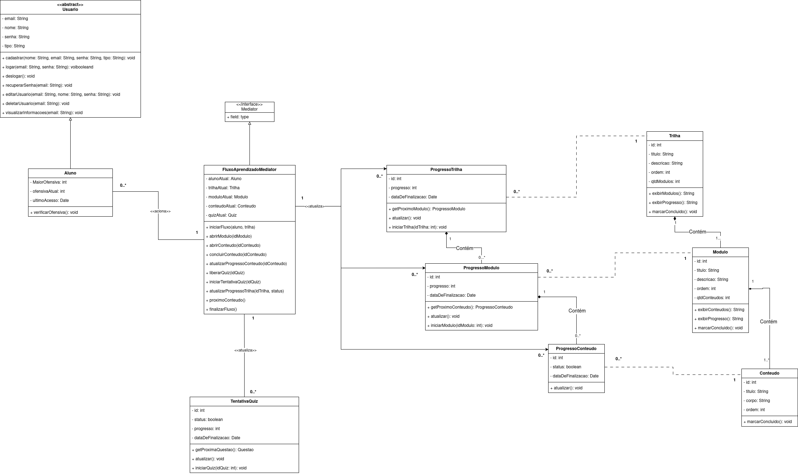

# Mediator

## Participantes

## 1. Introdução

O **Mediator** é um padrão de projeto comportamental da Gang of Four (GoF) que define um objeto centralizador (o mediador) responsável por coordenar as interações entre múltiplos objetos. Em vez de os objetos se comunicarem diretamente uns com os outros, criando acoplamento forte, todos se comunicam através do mediador, o qual concentra a lógica de coordenação.

Esse padrão é particularmente útil quando o sistema possui múltiplas entidades que precisam trabalhar em conjunto para atingir um objetivo comum, mas suas interações são complexas ou mudam frequentemente. Ao centralizar essa coordenação, o padrão reduz o acoplamento e torna o sistema mais flexível e fácil de manter.

## 2. Metodologia

No contexto da plataforma **ConhecendoRequisitos**, o padrão Mediator foi aplicado para orquestrar o fluxo de aprendizagem do aluno. A proposta é que, quando um aluno conclui um conteúdo, inicia um quiz ou avança para um módulo seguinte, o mediador seja responsável por coordenar todas as atualizações de estado necessárias: progresso do conteúdo, progresso do módulo, liberação do próximo elemento, criação de tentativas de quiz e atualização geral da trilha.

Com isso, a plataforma centraliza em uma única classe as regras de transição entre estados, evitando que Conteúdo, Módulo, Quiz e as classes de Progresso precisem se chamar diretamente, reduzindo o acoplamento e facilitando a manutenção das regras de negócio.

## 3. Estrutura e Participantes

A estrutura do padrão Mediator aplicada ao projeto é composta pelos seguintes elementos:

**Tabela 1: Participantes do padrão Mediator**

| Papel no Padrão      | Classe no Projeto                                                                                 | Responsabilidade                                         |
| -------------------- | ------------------------------------------------------------------------------------------------- | -------------------------------------------------------- |
| **Mediator**         | IMediator                                                                                         | Define a interface comum para coordenar interações.      |
| **ConcreteMediator** | FluxoAprendizagemMediator                                                                         | Implementa a lógica de coordenação do fluxo educacional. |
| **Colleague**        | Aluno, Conteúdo, Módulo, Quiz, ProgressoTrilha, ProgressoModulo, ProgressoConteudo, TentativaQuiz | Objetos que se comunicam através do mediador.            |

## 4. Diagrama



> **Figura 1:** Diagrama de Classes do padrão Mediator aplicado à orquestração do fluxo de aprendizagem da plataforma ConhecendoRequisitos.

## 5. Descrição das Classes

### 5.1. IMediator (Interface Mediator)

Interface que define os métodos públicos que o mediador disponibiliza para coordenar as interações entre os objetos colegas.

| Método                                                                        | Descrição                                                                   |
| ----------------------------------------------------------------------------- | --------------------------------------------------------------------------- |
| +notify(sender: Colleague, event: string, payload?: any): void                | Recebe notificações de eventos dos colegas e coordena as ações necessárias. |
| +concluirConteudo(alunoId: string, conteudoId: string): Promise<void>         | Coordena o fluxo quando um aluno conclui um conteúdo.                       |
| +iniciarQuiz(alunoId: string, quizId: string): Promise<TentativaQuiz \| null> | Coordena a criação e início de uma tentativa de quiz.                       |
| +verificarConclusaoModulo(moduloId: string): Promise<boolean>                 | Verifica se todos os conteúdos de um módulo foram concluídos.               |
| +obterProximoConteudo(alunoId: string, moduloId?: string): Conteudo \| null   | Retorna o próximo conteúdo a ser exibido após conclusão.                    |

### 5.2. FluxoAprendizagemMediator (ConcreteMediator)

Implementação concreta do mediador que coordena todas as interações no fluxo educacional.

| Atributo                              | Descrição                                                         |
| ------------------------------------- | ----------------------------------------------------------------- |
| -alunoAtual: Aluno                    | Aluno que está interagindo com o fluxo em uma determinada sessão. |
| -trilhaAtual: Trilha                  | Trilha atualmente sendo seguida pelo aluno.                       |
| -moduloAtual: Módulo                  | Módulo atualmente sendo visitado.                                 |
| -conteudoAtual: Conteúdo              | Conteúdo em visualização.                                         |
| -quizAtual: Quiz                      | Quiz ativo ou a ser iniciado.                                     |
| -progressoTrilha: ProgressoTrilha     | Registro de progresso na trilha.                                  |
| -progressoModulo: ProgressoModulo     | Registro de progresso no módulo.                                  |
| -progressoConteudo: ProgressoConteudo | Registro de progresso do conteúdo.                                |
| -tentativaQuiz: TentativaQuiz         | Tentativa atual de quiz.                                          |

| Método                                                                | Descrição                                                                   |
| --------------------------------------------------------------------- | --------------------------------------------------------------------------- |
| +iniciarFluxo(aluno: Aluno, trilha: Trilha): void                     | Inicializa o mediador para um aluno e trilha específicos.                   |
| +concluirConteudo(conteudoId: string): Promise<void>                  | Marca conteúdo como concluído, atualiza progresso e decide próximo passo.   |
| +verificarConclusaoDoModulo(moduloId: string): Promise<boolean>       | Verifica se módulo foi totalmente concluído e libera quiz se aplicável.     |
| +liberarQuiz(quizId: string): void                                    | Habilita a exibição e início de um quiz.                                    |
| +iniciarTentativaQuiz(quizId: string): TentativaQuiz                  | Cria uma nova tentativa de quiz para o aluno.                               |
| +atualizarProgressoConteudo(conteudoId: string, status: string): void | Atualiza o registro de progresso de um conteúdo.                            |
| +atualizarProgressoModulo(moduloId: string, status: string): void     | Atualiza o registro de progresso de um módulo.                              |
| +atualizarProgressoTrilha(trilhaId: string, status: string): void     | Atualiza o registro de progresso da trilha.                                 |
| +avançarParaProximoConteudo(): Conteudo \| null                       | Retorna o próximo conteúdo a ser exibido ou null se módulo/trilha terminou. |
| +finalizarFluxo(): void                                               | Encerra a sessão de aprendizagem do aluno.                                  |

### 5.3. Classes Colegas (Colleagues)

As classes **Aluno**, **Conteúdo**, **Módulo**, **Quiz**, **ProgressoTrilha**, **ProgressoModulo**, **ProgressoConteudo** e **TentativaQuiz** funcionam como "colleagues" (colegas) do padrão. Elas:

- Recebem notificações através do mediador e não se comunicam diretamente.
- Concentram-se em suas responsabilidades específicas (armazenar dados, validar estado local).
- Delegam coordenações complexas ao mediador.

## 6. Implementação

A implementação foi feita em **JavaScript (Node.js)** e organizada na pasta [gofs/comportamentais/mediator](../../gofs/comportamentais/mediator/index.js), seguindo a mesma estrutura de demonstração utilizada no padrão Composite: arquivos separados para cada participante do padrão e um arquivo de entrada para executar a demonstração completa.

<details>
<summary><b>Ver Código Fonte</b></summary>

**IMediator.js** — Interface que define o contrato do mediador:

```javascript
class IMediator {
  notify(sender, event, payload) {
    throw new Error("notify() deve ser implementado pela classe concreta.");
  }

  concluirConteudo(alunoId, conteudoId) {
    throw new Error(
      "concluirConteudo() deve ser implementado pela classe concreta.",
    );
  }

  iniciarTentativaQuiz(alunoId, quizId) {
    throw new Error(
      "iniciarTentativaQuiz() deve ser implementado pela classe concreta.",
    );
  }

  verificarConclusaoModulo(moduloId) {
    throw new Error(
      "verificarConclusaoModulo() deve ser implementado pela classe concreta.",
    );
  }

  obterProximoConteudo(alunoId, moduloId) {
    throw new Error(
      "obterProximoConteudo() deve ser implementado pela classe concreta.",
    );
  }
}

module.exports = IMediator;
```

**FluxoAprendizagemMediator.js** — Implementação concreta que orquestra o fluxo:

```javascript
const IMediator = require("./IMediator");
const ProgressoConteudo = require("./ProgressoConteudo");
const ProgressoModulo = require("./ProgressoModulo");
const TentativaQuiz = require("./TentativaQuiz");

class FluxoAprendizagemMediator extends IMediator {
  constructor() {
    super();
    this.alunoAtual = null;
    this.trilhaAtual = null;
    this.moduloAtual = null;
    this.conteudoAtual = null;
    this.quizAtual = null;
    this.progressoConteudos = new Map();
    this.progressoModulos = new Map();
    this.tentativasQuiz = new Map();
    this.proximoConteudoIndex = 0;
  }

  iniciarFluxo(alunoEmail, trilhaId) {
    console.log(
      `[MEDIATOR] Iniciando fluxo para aluno ${alunoEmail} na trilha ${trilhaId}.\n`,
    );
    this.proximoConteudoIndex = 0;
  }

  concluirConteudo(alunoEmail, conteudoId) {
    console.log(
      `[MEDIATOR] Processando conclusão do conteúdo ${conteudoId} pelo aluno ${alunoEmail}.\n`,
    );

    const chaveProgresso = `${alunoEmail}_${conteudoId}`;
    this.atualizarProgressoConteudo(alunoEmail, conteudoId, "concluído");

    if (this.moduloAtual && this.moduloAtual.verificarConclusao()) {
      const percentagem =
        (this.moduloAtual.conteudos.length /
          this.moduloAtual.conteudos.length) *
        100;
      this.atualizarProgressoModulo(
        alunoEmail,
        this.moduloAtual.id,
        percentagem,
      );
      this.liberarProximoQuiz(alunoEmail);
    }
  }

  atualizarProgressoConteudo(alunoEmail, conteudoId, status) {
    const chaveProgresso = `${alunoEmail}_${conteudoId}`;
    if (!this.progressoConteudos.has(chaveProgresso)) {
      this.progressoConteudos.set(
        chaveProgresso,
        new ProgressoConteudo(chaveProgresso, alunoEmail, conteudoId),
      );
    }
    this.progressoConteudos.get(chaveProgresso).atualizar(status);
  }

  atualizarProgressoModulo(alunoEmail, moduloId, percentagem) {
    const chaveProgresso = `${alunoEmail}_${moduloId}`;
    if (!this.progressoModulos.has(chaveProgresso)) {
      this.progressoModulos.set(
        chaveProgresso,
        new ProgressoModulo(chaveProgresso, alunoEmail, moduloId),
      );
    }
    this.progressoModulos.get(chaveProgresso).atualizar(percentagem);
  }

  verificarConclusaoModulo(moduloId) {
    return this.moduloAtual && this.moduloAtual.verificarConclusao();
  }

  liberarProximoQuiz(alunoEmail) {
    if (this.quizAtual) {
      this.liberarQuiz(this.quizAtual.id);
      this.iniciarTentativaQuiz(alunoEmail, this.quizAtual.id);
    }
  }

  liberarQuiz(quizId) {
    if (this.quizAtual) {
      console.log(
        `[MEDIATOR] Um quiz está disponível: ${this.quizAtual.titulo}\n`,
      );
    }
  }

  iniciarTentativaQuiz(alunoEmail, quizId) {
    console.log(
      `[MEDIATOR] Criando tentativa de quiz para aluno ${alunoEmail}.\n`,
    );
    const chaveTentativa = `${alunoEmail}_${quizId}`;
    if (!this.tentativasQuiz.has(chaveTentativa)) {
      const tentativa = new TentativaQuiz(chaveTentativa, alunoEmail, quizId);
      this.tentativasQuiz.set(chaveTentativa, tentativa);
      tentativa.iniciar();
    }
  }

  obterProximoConteudo(alunoEmail, moduloId) {
    if (
      this.moduloAtual &&
      this.proximoConteudoIndex < this.moduloAtual.conteudos.length
    ) {
      const conteudo = this.moduloAtual.conteudos[this.proximoConteudoIndex];
      console.log(`[MEDIATOR] Próximo conteúdo: ${conteudo.titulo}\n`);
      this.proximoConteudoIndex++;
      return conteudo;
    }
    return null;
  }

  finalizarFluxo(alunoEmail) {
    console.log(`[MEDIATOR] Finalizando fluxo para aluno ${alunoEmail}.\n`);
  }
}

module.exports = FluxoAprendizagemMediator;
```

**Classes Colegas** — Aluno.js, Conteudo.js, Modulo.js, Quiz.js, ProgressoConteudo.js, ProgressoModulo.js, TentativaQuiz.js (implementações completas disponíveis no repositório).

**index.js** — Demonstração completa do fluxo de orquestração:

```javascript
const FluxoAprendizagemMediator = require("./FluxoAprendizagemMediator");
const Aluno = require("./Aluno");
const Modulo = require("./Modulo");
const Conteudo = require("./Conteudo");
const Quiz = require("./Quiz");

console.log("======================================");
console.log("  DEMONSTRAÇÃO — Padrão Mediator");
console.log("======================================\n");

const mediator = new FluxoAprendizagemMediator();
const aluno = new Aluno("yasmin@unb.br", "Yasmin");
const modulo = new Modulo(
  1,
  "Introdução a Requisitos",
  "Conceitos iniciais",
  1,
);
const conteudo1 = new Conteudo(1, "O que é requisito?", "Definição base", 1);
const conteudo2 = new Conteudo(2, "Tipos de requisito", "Categorização", 2);
const quiz = new Quiz(1, "Quiz: Introdução", 5, 1);

modulo.adicionarConteudo(conteudo1);
modulo.adicionarConteudo(conteudo2);

mediator.moduloAtual = modulo;
mediator.quizAtual = quiz;
mediator.alunoAtual = aluno;

console.log("--- Estrutura criada ---");
console.log(`${aluno.toString()}`);
console.log(`${modulo.toString()}`);
console.log(`${conteudo1.toString()}`);
console.log(`${conteudo2.toString()}`);
console.log(`${quiz.toString()}\n`);

console.log("--- Progresso inicial ---");
console.log(modulo.exibirProgresso());
console.log(conteudo1.exibirProgresso());
console.log(conteudo2.exibirProgresso());

console.log("\n--- Aluno seleciona trilha e começa fluxo ---");
aluno.selecionarTrilha(mediator, 1);
mediator.iniciarFluxo(aluno.email, 1);

console.log("--- Obtendo próximo conteúdo ---");
const prox = mediator.obterProximoConteudo(aluno.email, 1);

console.log("--- Aluno conclui conteúdo ---");
aluno.concluirConteudo(mediator, conteudo1.id);

console.log("--- Aluno conclui segundo conteúdo ---");
aluno.concluirConteudo(mediator, conteudo2.id);

console.log("--- Progresso após conclusão de conteúdos ---");
console.log(modulo.exibirProgresso());
for (const [chave, progresso] of mediator.progressoModulos) {
  console.log(`${progresso.toString()}`);
}

console.log("\n--- Aluno inicia quiz liberado ---");
aluno.iniciarQuiz(mediator, quiz.id);

console.log("--- Finalizando fluxo ---\n");
mediator.finalizarFluxo(aluno.email);

console.log("======================================");
console.log("  FIM DA DEMONSTRAÇÃO");
console.log("======================================");
```

</details>

### Saída esperada

```
======================================
  DEMONSTRAÇÃO — Padrão Mediator
======================================

--- Estrutura criada ---
Aluno(email='yasmin@unb.br', nome='Yasmin', ofensiva=0)
Modulo(id=1, titulo='Introdução a Requisitos', ordem=1, qtdConteudos=2)
Conteudo(id=1, titulo='O que é requisito?', ordem=1)
Conteudo(id=2, titulo='Tipos de requisito', ordem=2)
Quiz(id=1, titulo='Quiz: Introdução', modulo=1)

--- Progresso inicial ---
Módulo 'Introdução a Requisitos': 0/2 conteúdos concluídos.
Conteúdo 'O que é requisito?': pendente.
Conteúdo 'Tipos de requisito': pendente.

--- Aluno seleciona trilha e começa fluxo ---
[ALUNO] 'Yasmin' selecionou a trilha 1.

[MEDIATOR] Iniciando fluxo para aluno yasmin@unb.br na trilha 1.


--- Obtendo próximo conteúdo ---
[MEDIATOR] Próximo conteúdo: O que é requisito?

--- Aluno conclui conteúdo ---
[CONTEUDO] 'O que é requisito?' marcado como concluído.
[ALUNO] 'Yasmin' concluiu o conteúdo 1.

[MEDIATOR] Processando conclusão do conteúdo 1 pelo aluno yasmin@unb.br.

[PROGRESSO_CONTEUDO] Conteúdo 1 do aluno yasmin@unb.br finalizado em 15/05/2026, 10:26:29.

--- Aluno conclui segundo conteúdo ---
[CONTEUDO] 'Tipos de requisito' marcado como concluído.
[ALUNO] 'Yasmin' concluiu o conteúdo 2.

[MEDIATOR] Processando conclusão do conteúdo 2 pelo aluno yasmin@unb.br.

[PROGRESSO_CONTEUDO] Conteúdo 2 do aluno yasmin@unb.br finalizado em 15/05/2026, 10:26:29.
[MODULO] 'Introdução a Requisitos' foi concluído por completo.
[PROGRESSO_MODULO] Módulo 1 do aluno yasmin@unb.br agora em 100%.
[PROGRESSO_MODULO] Módulo 1 concluído em 15/05/2026, 10:26:29.
[MEDIATOR] Um quiz está disponível: Quiz: Introdução

[MEDIATOR] Criando tentativa de quiz para aluno yasmin@unb.br.

[TENTATIVA_QUIZ] Tentativa 1 iniciada para o quiz 1.

--- Progresso após conclusão de conteúdos ---
Módulo 'Introdução a Requisitos': 2/2 conteúdos concluídos.
ProgressoModulo(aluno='yasmin@unb.br', modulo=1, progresso=100%)

--- Aluno inicia quiz liberado ---
[ALUNO] 'Yasmin' iniciou o quiz 1.

[MEDIATOR] Criando tentativa de quiz para aluno yasmin@unb.br.


--- Finalizando fluxo ---

[MEDIATOR] Finalizando fluxo para aluno yasmin@unb.br.

======================================
  FIM DA DEMONSTRAÇÃO
======================================
```

## Vídeo de demonstração

## Repositório com o código

[Clique aqui para visualizar o código do Mediator]()

## 7. Senso Crítico

A aplicação do padrão **Mediator** no contexto do projeto **ConhecendoRequisitos** se mostra adequada para resolver o acoplamento que naturalmente surge quando múltiplas entidades precisam trabalhar em conjunto para coordenar o progresso do aluno. Sem o mediador, cada transição (conclusão de conteúdo → atualizar progresso → verificar módulo → liberar quiz → criar tentativa) teria que ser implementada diretamente nas classes, gerando referências circulares e difícil manutenção.

Com o mediador centralizado, as regras de negócio ficam num único lugar, facilitando futuras mudanças nas políticas de liberação de conteúdo, quiz ou trilha. Por exemplo, se no futuro decidir-se que o aluno precisa atingir uma nota mínima antes de avançar, basta alterar a lógica no mediador, sem tocar em Conteúdo, Módulo ou Quiz.

Como limitação da abordagem, o mediador pode crescer bastante em complexidade se o fluxo de aprendizagem se tornar muito intrincado. Para mitigar isso, é possível quebrar a lógica em métodos auxiliares privados (extract method) ou até usar sub-mediadores para diferentes aspectos do fluxo (por exemplo, um para conteúdo, outro para quiz).

Do ponto de vista arquitetural, o padrão reforça boas práticas de separação de responsabilidades e princípio de inversão de dependência: as classes não dependem umas das outras, mas todas dependem da interface do mediador.

## 8. Conclusão

A aplicação do padrão **Mediator** na plataforma "ConhecendoRequisitos" centraliza as regras de transição e coordenação do aprendizado em uma única classe, reduzindo acoplamento e tornando o sistema mais flexível e fácil de manter. Ao delegar toda a orquestração para o mediador, as classes colegas (Aluno, Conteúdo, Módulo, Quiz, Progresso\*) podem se manter simples e focadas em suas responsabilidades individuais.

Essa arquitetura permite que mudanças nas regras de fluxo sejam implementadas de forma centralizada e controlada, sem afetar a lógica de cada entidade. Além disso, facilita testes unitários e a evolução futura do sistema, abrindo espaço para novas regras de gamificação, restrições de acesso ou políticas de liberação de conteúdo.

## 9. Referências Bibliográficas

1. GAMMA, E.; HELM, R.; JOHNSON, R.; VLISSIDES, J. **Design Patterns: Elements of Reusable Object-Oriented Software**. Reading, MA: Addison-Wesley, 1995.

2. REFACTORING GURU. **Mediator**. Disponível em: [https://refactoring.guru/design-patterns/mediator](https://refactoring.guru/design-patterns/mediator). Acesso em: 15 mai. 2026.

3. FREEMAN, E.; ROBSON, E. **Head First Design Patterns**. 2. ed. Sebastopol, CA: O'Reilly Media, 2020.

4. LARMAN, C. **Utilizando UML e Padrões**. 3. ed. Porto Alegre: Bookman, 2007.

## Histórico de versões

| 1.0 | 15/05 | Criação do documento | [Yan Aguiar](https://github.com/Yanmatheus0812) | [Yasmin Nascimento](https://github.com/yasminnas)| Documento criado |
| 1.1 | 15/05 | Implementação do código Composite e inclusão da demonstração | [Yan Aguiar](https://github.com/Yanmatheus0812) | [Yasmin Nascimento](https://github.com/yasminnas) | Revisado e aprovado |
