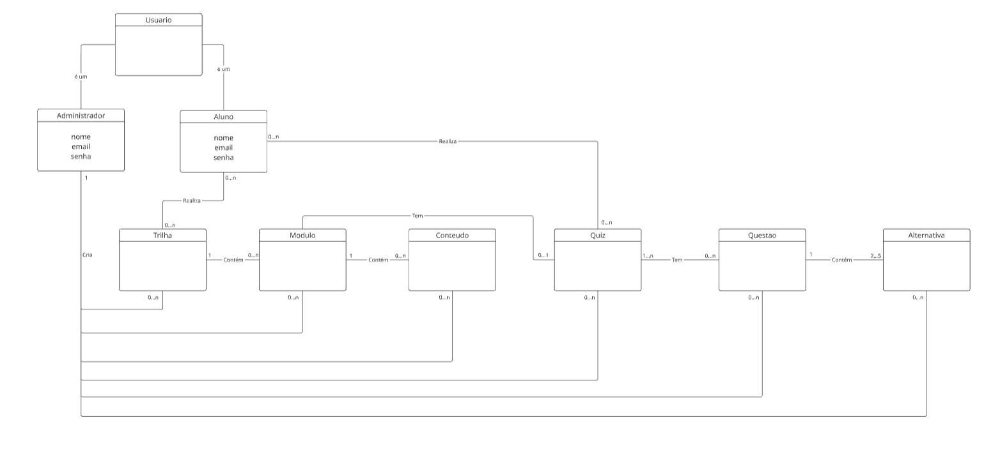

# Modelo de Domínio

## Participantes

Os participantes da elaboração deste documento estão descritos na tabela a seguir:

**Tabela 1:** Participantes

| Matrícula | Aluno |
| --------- | ----- |
| 231027032 | Arthur Oliveira |
| 222006650 | Davi Sousa |
|  200067095 | Lucas Avelar |
| 231038303 | Yan Aguiar |

---

## 1. Introdução

O Modelo de Domínio representa os principais elementos estruturais da plataforma **ConhecendoRequisitos**, descrevendo as entidades do sistema, seus atributos e os relacionamentos existentes entre elas.

Seu objetivo é fornecer uma visão conceitual do funcionamento da aplicação, permitindo compreender como usuários, trilhas, módulos, conteúdos e quizzes interagem dentro da plataforma educacional.

O modelo foi elaborado com base nos requisitos funcionais definidos anteriormente, buscando representar de forma clara as regras de negócio relacionadas à autenticação, gerenciamento de conteúdo, progresso de aprendizado e resolução de quizzes.

---

## 2. Metodologia

A construção do modelo de domínio foi realizada a partir da análise dos requisitos funcionais e regras de negócio levantados nas entregas anteriores do projeto.

A equipe utilizou os seguintes princípios durante a modelagem:

- Identificação das entidades centrais do sistema;
- Definição dos relacionamentos e cardinalidades;
- Separação entre perfis de usuário;
- Organização hierárquica dos conteúdos educacionais;
- Representação do fluxo de aprendizado do aluno;
- Estruturação do sistema de quizzes e questões.

O modelo foi desenvolvido utilizando UML, permitindo representar visualmente as relações entre os componentes do domínio da aplicação.

---

## 3. Estrutura do Modelo de Domínio

O modelo de domínio da plataforma é composto pelas seguintes entidades principais:

| Entidade | Responsabilidade |
| -------- | ---------------- |
| Usuario | Representa a entidade base do sistema |
| Administrador | Gerencia conteúdos e estrutura da plataforma |
| Aluno | Realiza trilhas, conteúdos e quizzes |
| Trilha | Agrupa módulos de aprendizagem |
| Modulo | Organiza conteúdos educacionais |
| Conteudo | Representa materiais de estudo |
| Quiz | Avaliação relacionada ao conteúdo |
| Questao | Perguntas pertencentes ao quiz |
| Alternativa | Possíveis respostas da questão |

---

## 3.1 Diagrama UML do Modelo de Domínio

A figura abaixo apresenta o Modelo de Domínio da plataforma **ConhecendoRequisitos**.

**Figura 1:** Modelo de Domínio da plataforma ConhecendoRequisitos.

**Fonte:** Elaborado pelos autores (2026).

---

## 4. Descrição das Entidades

### 4.1 Usuario

Classe base responsável por representar os usuários do sistema.

| Atributo | Descrição |
| -------- | --------- |
| nome | Nome do usuário |
| email | Email utilizado para autenticação |
| senha | Senha de acesso |

---

### 4.2 Administrador

Especialização de **Usuario** responsável pelo gerenciamento da plataforma.

**Responsabilidades:**

- Criar trilhas;
- Gerenciar módulos;
- Adicionar conteúdos;
- Criar quizzes e questões.

---

### 4.3 Aluno

Especialização de **Usuario** responsável pela interação educacional da plataforma.

**Responsabilidades:**

- Realizar trilhas;
- Consumir conteúdos;
- Resolver quizzes;
- Acompanhar progresso.

---

### 4.4 Trilha

Representa uma sequência de aprendizado composta por módulos.

**Relacionamentos:**

- Uma trilha contém um ou mais módulos;
- Um aluno pode realizar várias trilhas.

---

### 4.5 Modulo

Representa agrupamentos de conteúdos relacionados.

**Relacionamentos:**

- Um módulo pertence a uma trilha;
- Um módulo contém conteúdos.

---

### 4.6 Conteudo

Representa os materiais educacionais da plataforma.

**Relacionamentos:**

- Um conteúdo pertence a um módulo;
- Um conteúdo pode possuir um quiz.

---

### 4.7 Quiz

Representa avaliações relacionadas aos conteúdos.

**Relacionamentos:**

- Um quiz pode possuir várias questões;
- Um aluno pode realizar diversos quizzes.

---

### 4.8 Questao

Representa perguntas pertencentes a um quiz.

**Relacionamentos:**

- Uma questão pertence a um quiz;
- Uma questão contém alternativas.

---

### 4.9 Alternativa

Representa possíveis respostas de uma questão.

**Relacionamentos:**

- Uma alternativa pertence a uma questão.

---

## 5. Relacionamentos e Cardinalidades

Durante a modelagem foram definidos os seguintes relacionamentos principais:

| Relacionamento | Cardinalidade |
| -------------- | ------------- |
| Trilha → Módulo | 1 para 0..n |
| Módulo → Conteúdo | 1 para 0..n |
| Conteúdo → Quiz | 0..1 para 0..n |
| Quiz → Questão | 1..n para 0..n |
| Questão → Alternativa | 1 para 2..5 |
| Aluno → Trilha | 0..n |
| Aluno → Quiz | 0..n |

---

## 6. Senso Crítico

Durante a elaboração do Modelo de Domínio, a equipe percebeu que uma das maiores dificuldades foi representar corretamente as relações entre os componentes do sistema sem gerar excesso de complexidade visual.

Os debates sobre cardinalidade, composição e agregação foram fundamentais para amadurecer a modelagem. Inicialmente, algumas relações estavam excessivamente acopladas, principalmente entre conteúdos, quizzes e progresso do aluno. Após diversas revisões, o grupo conseguiu simplificar o modelo mantendo coerência com as regras de negócio.

Outro ponto importante foi entender que o Modelo de Domínio não representa implementação técnica, mas sim a visão conceitual do sistema. Isso ajudou a equipe a evitar detalhes desnecessários de banco de dados ou código durante a modelagem UML.

A validação coletiva permitiu identificar inconsistências e melhorar a organização estrutural da plataforma, tornando o modelo mais claro, modular e alinhado aos requisitos do projeto.

---

## 7. Conclusão

O Modelo de Domínio da plataforma **ConhecendoRequisitos** permitiu estruturar de forma clara os principais elementos do sistema e suas interações.

A modelagem contribuiu para o entendimento das regras de negócio, servindo como base para futuras etapas de desenvolvimento, banco de dados e implementação da aplicação.

Além disso, o documento auxiliou no alinhamento da equipe sobre a arquitetura conceitual da plataforma, reduzindo ambiguidades e fortalecendo a padronização do projeto.

---

## Referências Bibliográficas

BOOCH, G.; RUMBAUGH, J.; JACOBSON, I. **UML: Guia do Usuário**. Rio de Janeiro: Elsevier, 2005.

FOWLER, M. **UML Essencial**. 3. ed. Porto Alegre: Bookman, 2005.

LARMAN, C. **Utilizando UML e Padrões**. 3. ed. Porto Alegre: Bookman, 2007.

PRESSMAN, R. **Engenharia de Software**. 8. ed. Porto Alegre: AMGH, 2016.

MIRO. **Miro: Online Collaborative Whiteboard Platform**. Disponível em: https://miro.com/. Acesso em: 13 maio 2026.

---

## Histórico de Versões

| Versão | Data | Descrição | Autor(es) | Revisor(es) | Detalhes da Revisão |
| ------ | ---- | --------- | --------- | ----------- | ------------------- |
| 1.0 | 13/05/2026 | Criação do documento do Modelo de Domínio | [Yasmin Nascimento](https://github.com/Yasm1nNasc1mento) | -- | Documento criado |